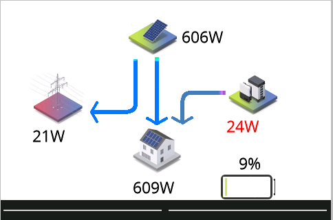
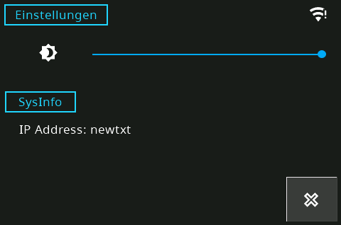

# Fork Changes
redesign of ui handling logic.
ui logic will now handled in tasmota driver 

## Tasmota Driver
used driver: ./tasmota/nspanel_logic.be

GenerateWidgetJson.py

Mapping of pages is defined here, and generate a json map for the widget variable in the nspanel_logic.be
Variable widgetDefinition is direct mapping to the the hmi defined pages elements, etc..
Variable widget is the instance abstraction of the widgetDefinition


```
   var widgetDefinition = {"$pageName"  : {
           "components" : { "$internalID": ["$IDofNextionElement","$NameofNextionElement",$type]    
      },
           "syscomponents" : { "$internalID" : ["$IDofNextionElement","$NameofNextionElement",$type]
         }
    }
```

```
var widgetDefinition = {
    "sysPopup"  : {
           "components" : { "1": ["3","buttonClose",componentTypeButton],
                            "2": ["9","txtIp",componentTypeText], 
                            "3": ["2","sliderDim",componentTypeSlider]       
      },
           "syscomponents" : { "1" : ["12","tTime",componentTypeText],
                               "2" : ["7","vaWifi",componentTypeIntVar] 
         }
    },
    "cardSolar" :
    {      
       "components" : { "1": ["21","vaSolarPanel",componentTypeIntVar],
                        "2": ["20","vaBattery",componentTypeIntVar], 
                        "3": ["55","vaHouse",componentTypeIntVar],  
                        "4": ["19","vaGrid",componentTypeIntVar],
                        "5": ["26","vaBatteryChaS",componentTypeIntVar],                   
                        "6": ["29","mSys",componentTypeHotspot], 
                        "7": ["10","mRight",componentTypeHotspot],
                        "8": ["53","mleft",componentTypeHotspot],        
                      },
        "syscomponents" : { "1" : ["61","tTime",componentTypeText],
                            "2" : ["63","vaWifi",componentTypeIntVar],
                            "3": ["47","txtNoData",componentTypeText],
                    }
    }    
}
```

```
var widget = {
   "0" : {"page" : "sysPopup",
          "backNav" : "",
          "components" : {
              "1" :{"visible" : "true","action":actionUsebackNav,"value" : "1"},
              "2" :{"visible" : "true","value" :"0"},
              "3" :{"visible" : "true","value" :"0"}
          }
   },
   "1": {  "page" : "cardSolar",
         "components": { 
            "1": {"visible" : "true","mqttMappingName" : "powerSolar","value" :"0"},
            "2": {"visible" : "true","mqttMappingName" : "powerBattery","value" :"0"},
            "3": {"visible" : "true","mqttMappingName" : "powerHouse","value" :"0"},
            "4": {"visible" : "true","mqttMappingName" : "powerGrid","value" :"0"},
            "5": {"visible" : "true","mqttMappingName" : "batteryChargeState","value" :"0"},                        
            "6": { "action" : actionShowPopup,"value" : "0",}
         }         
     }
}
```
### SolarCard
Show the current power flow from house to grid, battery and solar system



### WindowCard
Shows the status of the house windows
![screens-cardWindow](doc-pics/card-window.png

### PopupVacuum
Control Panel for Vacuum cleaner
![screens-popupVacuum](doc-pics/popupVacuum.png

### SysPopup
Allows to change the brightness settings, and shows system informations

## Documentation

Visit https://docs.nspanel.pky.eu/ for installation instructions and documentation of the configuration.
