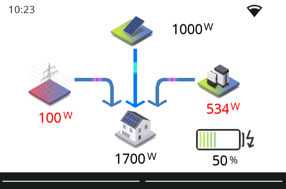

# Content
- Ui Logic and chaining is handled in tasmota driver
- Page cache in tasmota driver
- Configurable swiping (left,up,right,down) for page change etc..
- Clock & Wifi Symbol
- the state of physical buttons will be displayed at bottom as bars on every page 

## Cards
cards based on joBr99/nspanel-lovelace-ui
- cardAlarm
- cardEntities
- cardGrid
- cardThermo
- cardMedia
- cardQR
- popupLight
- popupShutter
- popupFan
- popupNotify

New cards
- cardSolar
- cardWindows
- popupVacuum
- sysPopup

### SolarCard
Show the current power flow from house to grid, battery and solar system




### WindowCard
Shows the status of the house windows


### PopupVacuum
Control Panel for Vacuum cleaner


### SysPopup
Allows to change the brightness,timeout settings, and shows system informations


## Video
[Demo](https://youtu.be/geTI_2iE--Y)

## Pictures


## Tasmota Driver
used driver: ./tasmota/nspanel_logic.be

GenerateWidgetJson.py

Mapping of pages is defined here, and generate a json map for the widget variable in the nspanel_logic.be
Variable widgetDefinition is direct mapping to the the hmi defined pages elements, etc..
Variable widget is the instance abstraction of the widgetDefinition


```
   var widgetDefinition = {"$pageName"  : {
           "components" : { "$internalID": ["$IDofNextionElement","$NameofNextionElement",$type]    
      },
           "syscomponents" : { "$internalID" : ["$IDofNextionElement","$NameofNextionElement",$type]
         }
    }
```

```
var widgetDefinition = {
    "sysPopup"  : {
           "components" : { "1": ["3","buttonClose",componentTypeButton],
                            "2": ["9","txtIp",componentTypeText], 
                            "3": ["2","sliderDim",componentTypeSlider]       
      },
           "syscomponents" : { "1" : ["12","tTime",componentTypeText],
                               "2" : ["7","vaWifi",componentTypeIntVar] 
         }
    },
    "cardSolar" :
    {      
       "components" : { "1": ["21","vaSolarPanel",componentTypeIntVar],
                        "2": ["20","vaBattery",componentTypeIntVar], 
                        "3": ["55","vaHouse",componentTypeIntVar],  
                        "4": ["19","vaGrid",componentTypeIntVar],
                        "5": ["26","vaBatteryChaS",componentTypeIntVar],                   
                        "6": ["29","mSys",componentTypeHotspot], 
                        "7": ["10","mRight",componentTypeHotspot],
                        "8": ["53","mleft",componentTypeHotspot],        
                      },
        "syscomponents" : { "1" : ["61","tTime",componentTypeText],
                            "2" : ["63","vaWifi",componentTypeIntVar],
                            "3": ["47","txtNoData",componentTypeText],
                    }
    }    
}
```

```
var widget = {
   "0" : {"page" : "sysPopup",
          "backNav" : "",
          "components" : {
              "1" :{"visible" : "true","action":actionUsebackNav,"value" : "1"},
              "2" :{"visible" : "true","value" :"0"},
              "3" :{"visible" : "true","value" :"0"}
          }
   },
   "1": {  "page" : "cardSolar",
         "components": { 
            "1": {"visible" : "true","mqttMappingName" : "powerSolar","value" :"0"},
            "2": {"visible" : "true","mqttMappingName" : "powerBattery","value" :"0"},
            "3": {"visible" : "true","mqttMappingName" : "powerHouse","value" :"0"},
            "4": {"visible" : "true","mqttMappingName" : "powerGrid","value" :"0"},
            "5": {"visible" : "true","mqttMappingName" : "batteryChargeState","value" :"0"},                        
            "6": { "action" : actionShowPopup,"value" : "0",}
         }         
     }
}
```
| Item | Description | Syntax |
| ---- | ----------- | ------ |
| page | name of the used page definition for this instance | "page" : "sysPopup" |
| backNav | only used internally for the return page | |
| visible | true/false defines whether the component is visible | "visible" : "true" |
| value | value for a val or txt of component , is also used as a cache | "value" :"0" |
| mqttMappingName | name of the component represented in a mqtt message | "mqttMappingName" : "powerSolar" |
| mqttValueMapping | hashtable for value, mapping for mqtt submitted values | "mqttValueMapping":{"ON":"1","OFF":"0"} |
| text | set the txt attribute of a component [1] | "text": "1234txt" | 
| valueBasedText | hastable for value , set the txt attribute based on the value mapping | "valueBasedText":{"1":symbolLightBulbOn,"0":symbolLightBulb} |
| valueBasedColor | hastable for value , set the forecolor of component based on the value mapping | "valueBasedColor":{"1":"65504","0":"65535"} |
| action | action for component, if nextion raises a "released event" [2] | "action" : actionShowPage

[1]
for a button component value is used for button.value and text for button.txt
[2]
| action | Description |
| ---- | ----------- |
| actionRaiseEvent | raises a mqtt message |
| actionShowPage | navigate to page, the page is defined in value |
| actionShowPopup | navigate to page and stores the current page in backNav, the page is defined in value |
| actionUsebackNav | navigate to the page stored in backNav |